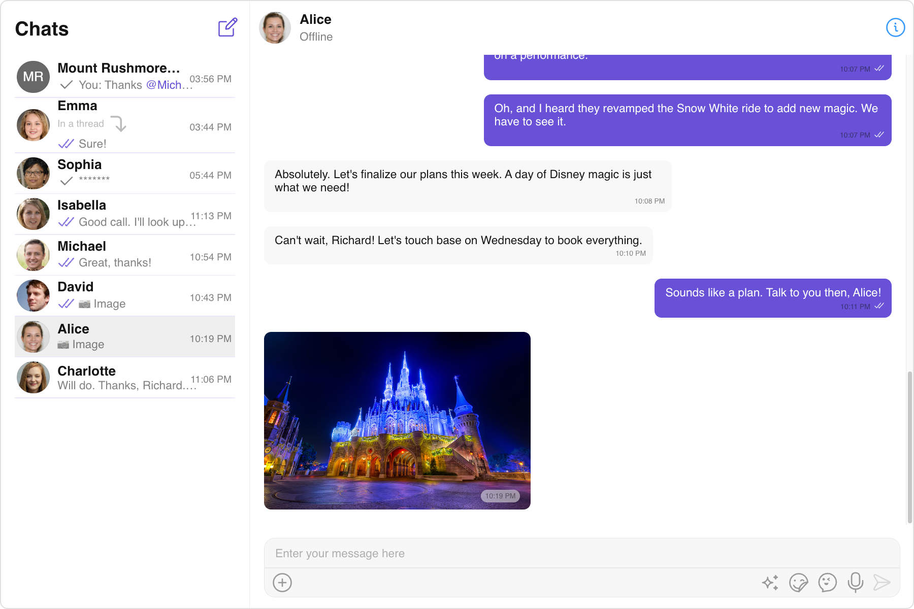

<p align="center">
  
</p>


# React Sample App by CometChat

This is a reference application showcasing the integration of [CometChat's React UI Kit](https://www.cometchat.com/docs/v4/react-uikit/overview) within a React framework. It provides developers with examples of implementing real-time messaging and voice and video calling features in their own React-based applications.

<div style="
    display: flex;
    align-items: center;
    justify-content: center;">
   
</div>

## Prerequisites

- Ensure that you have Node.js and npm installed:

    ```sh
      npm install npm@latest -g
    ```

- Sign up for a [CometChat](https://app.cometchat.com/) account to get your app credentials: _`App ID`_, _`Region`_, and _`Auth Key`_


## Installation
1. Clone the repository:
    ```sh
      git clone https://github.com/cometchat/cometchat-sample-app-react.git
    ```
2. Navigate to the cloned directory:
    ```sh
      cd cometchat-sample-app-react
    ```
3. Install dependencies:
    ```sh
      npm install
    ```
4. Enter your CometChat _`App ID`_, _`Region`_, and _`Auth Key`_ in the [src/AppConstants.ts](https://github.com/cometchat/cometchat-sample-app-react/blob/v4/src/AppConstants.ts) file:
    https://github.com/cometchat/cometchat-sample-app-react/blob/ce2a0d3460cabd9f0500f499c008ca930111f842/src/AppConstants.ts#L1-L7
5. Run the project locally to see all CometChat features in action:
    ```
      npm run start
    ```


## Help and Support
For issues running the project or integrating with our UI Kits, consult our [documentation](https://www.cometchat.com/docs/react-uikit/integration) or create a [support ticket](https://help.cometchat.com/hc/en-us) or seek real-time support via the [CometChat Dashboard](http://app.cometchat.com/).
