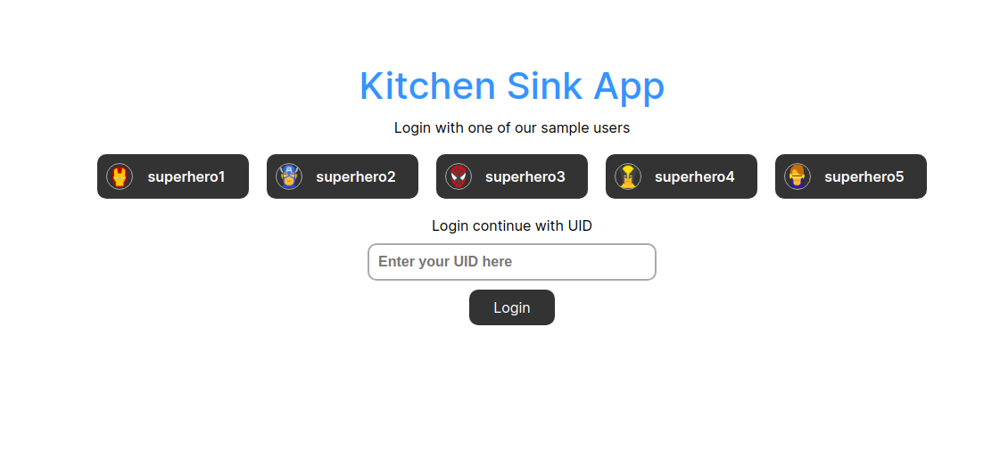
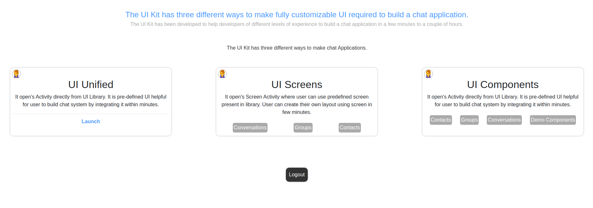

<div style="width:100%">
    <div style="width:50%;">
        <div align="center">
            
        </div>    
    </div>    
</div>

<br/><br/>

# React Chat App

<p align="left">
    <a href="https://github.com/cometchat-pro/javascript-react-chat-app/releases/" alt="Releases">
    
    </a>
    <a href="https://img.shields.io/github/languages/top/cometchat-pro/javascript-react-chat-app">
    
    </a>
    <a href="https://github.com/cometchat-pro/javascript-react-chat-app/stargazers">
    
    </a>
    <a href="https://twitter.com/CometChat">
    
    </a>
</p>





CometChat Kitchen Sink Sample App (built using **CometChat UIKit**) is a fully functional messaging app capable of **one-on-one** (private) and **group** messaging as well as Calling. This sample app enables users to send **text** and **multimedia messages like  images, videos, documents**. Also, users can make  **Audio** and **Video** calls to other users or groups.

___

## Prerequisites

Before you begin, ensure you have met the following requirements:

- React v16.14.0

- React DOM v16.14.0

___

## Installing React Chat App

1. Clone this repository
2. Navigate to the root directory and replace `APP_ID`, `REGION` and `AUTH_KEY` with your CometChat `App ID`, `Region` and `Auth Key` in src/consts.js file.


3. Install dependencies

```javascript
  npm install
```
___

## Running the sample app

```javascript
  npm start
```
___

## Add UI Kit to your project

Learn more about how to integrate [UI Kit](https://github.com/cometchat-pro/javascript-react-chat-ui-kit) inside your app. 

---

# Troubleshooting

- To read the full dcoumentation on UI Kit integration visit our [Documentation](https://prodocs.cometchat.com/docs/react-ui-kit).

- Facing any issues while integrating or installing the UI Kit please <a href="https://app.cometchat.com/"> connect with us via real time support present in CometChat Dashboard.</a>

---
# Contributors

Thanks to the following people who have contributed to this project:

[@priyadarshininadar](https://github.com/priyadarshininadar) <br>
[@ajaygajra](https://github.com/ajaygajra) <br>
[@prathamesh-majgaonkar](https://github.com/prathamesh-majgaonkar) <br>
[@mayur-bhandari](https://github.com/mayur-bhandari)


---

# Contact

Contact us via real time support present in [CometChat Dashboard.](https://app.cometchat.com/)

---

# License

---

This project uses the following [license](https://github.com/cometchat-pro/javascript-react-chat-app/blob/master/License.md).