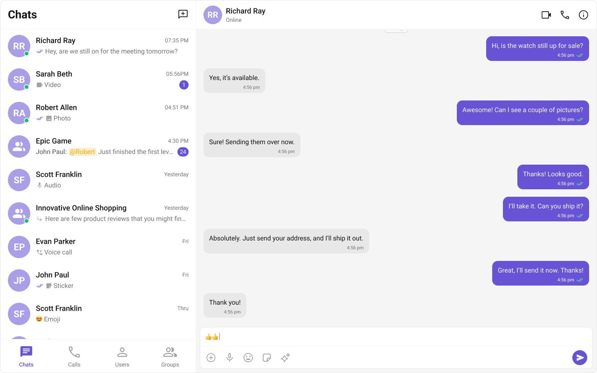

  

# CometChat UI Kit for React

The CometChat React UI Kit provides a pre-built user interface kit that developers can use to quickly integrate a reliable & fully-featured chat experience into an existing or a new app.

   

## 🚀 Explore the Sample App!

Dive straight into our [Sample App](./sample-app) to see CometChat UI Kit in action! Whether you're building a messaging app or enhancing your existing project, this sample app showcases the full potential of our React UI components.  

## Prerequisites

- Node.js >= 14.17.0
- npm >= 7

## Getting Started

To set up CometChat React UI Kit and utilize CometChat for your chat and calls functionality, you'll need to follow these steps:

- Register at the [CometChat Dashboard](https://app.cometchat.com/) to create an account.
- After registering, log into your CometChat account and create a new app. Once created, CometChat will generate an Auth Key and App ID for you. Keep these credentials secure as you'll need them later.
- Check the [Key Concepts](https://www.cometchat.com/docs/fundamentals/key-concepts) to understand the basic components of CometChat.
- Refer to the [Integration Steps](https://www.cometchat.com/docs/ui-kit/react/5.0/integration) in our documentation to integrate the UI Kit into your React app.

## Help and Support

For issues running the project or integrating with our UI Kits, consult our [documentation](https://www.cometchat.com/docs/ui-kit/react/5.0/integration) or create a [support ticket](https://help.cometchat.com/hc/en-us) or seek real-time support via the [CometChat Dashboard](https://app.cometchat.com/).
