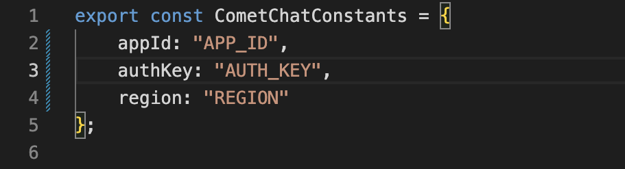

<div style="width:100%">
    <div style="width:50%;">
        <div align="center">
        
        </div>
    </div>
</div>

</br></br>

> **Note**

Version 4 CometChat UI Kits 

We’ve introduced a major update to CometChat UI kits. Version 4 features a modular architecture that gives you enhanced flexibility to build and customize your web and mobile apps. Please switch to the branch [v4](https://github.com/cometchat-pro/cometchat-chat-sample-app-react/tree/v4) to check out the sample app based on this version. [Visit our documentation](https://www.cometchat.com/docs/react-v4-uikit/overview) to read more about this.
<br/><br/>

# CometChat Kitchen Sink Sample App (React)

<p align="left">
    <a href="https://github.com/cometchat-pro/cometchat-pro-react-sample-app/releases/" alt="Releases">
        
    </a>
    <a href="https://img.shields.io/github/languages/top/cometchat-pro/cometchat-pro-react-sample-app">
        
    </a>
    <a href="https://github.com/cometchat-pro/cometchat-pro-react-sample-app/stargazers">
        
    </a>
    <a href="https://twitter.com/CometChat">
        
    </a>
</p>


CometChat Kitchen Sink Sample App (built using **CometChat UI Kit**) is a fully functional real-time messaging app capable of private (one-on-one), group messaging, voice & video calling.

## Features
- Login
- Private(1-1) & Group Conversations
- Voice & video calling & conferencing
- Rich Media Attachments
- Typing Indicators
- Text, Media and Custom messages
- Read receipts
- Online Presence Indicators
- Message History
- Users & Friends List
- Groups List
- Search by users and groups
- Conversations List
- Threaded Conversations

 ## Extensions

 [Thumbnail Generation](https://www.cometchat.com/docs/extensions/thumbnail-generation) | [Link Preview](https://www.cometchat.com/docs/extensions/link-preview) | [Rich Media Preview](https://www.cometchat.com/docs/extensions/rich-media-preview) | [Smart Replies](https://www.cometchat.com/docs/extensions/smart-replies)| [Emojis](https://www.cometchat.com/docs/extensions/emojis) | [Polls](https://www.cometchat.com/docs/extensions/polls) | [Reactions](https://www.cometchat.com/docs/extensions/reactions) | [Stickers](https://www.cometchat.com/docs/extensions/stickers)

<hr/>

## Prerequisites

Before you begin, ensure you have met the following requirements:

- React `npm install react@17.0.2`

- React DOM `npm install react-dom@17.0.2`

- React scripts `npm install react-scripts@4.0.3`

___

## Installing React Sample App

1. Clone this repository `git clone https://github.com/cometchat-pro/javascript-react-chat-app.git`
2. Navigate to the root directory and replace `APP_ID`, `REGION` and `AUTH_KEY` with your CometChat `App ID`, `Region` and `Auth Key` in src/consts.js file.



3. Install dependencies

    a. Add node-sass dependency in your project.
    ```javascript
    npm install node-sass@version
    ```
    <b> Note</b>: Cross check for the compatible version of this dependency with your system's node version in the link given below <br />
        <a href="https://www.npmjs.com/package/node-sass">https://www.npmjs.com/package/node-sass</a>

    b.

    ```javascript
    npm install
    ```
___

## Running the sample app

```javascript
  npm start
```
___

## Add UI Kit to your project

Learn more about how to integrate [UI Kit](https://github.com/cometchat-pro/cometchat-chat-uikit-react/) inside your app.

---

# Troubleshooting

- To read the full dcoumentation on UI Kit integration visit our [Documentation](https://www.cometchat.com/docs/react-chat-ui-kit/overview).

- Facing any issues while integrating or installing the UI Kit please connect with us via real time support present in <a href="https://app.cometchat.com/">CometChat Dashboard.</a>

---
# Contributors

Thanks to the following people who have contributed to this project:

[@priyadarshininadar](https://github.com/priyadarshininadar) <br>
[@ajaygajra](https://github.com/ajaygajra) <br>
[@prathamesh-majgaonkar](https://github.com/prathamesh-majgaonkar) <br>
[@mayur-bhandari](https://github.com/mayur-bhandari)


---

# Contact

Contact us via real time support present in [CometChat Dashboard.](https://app.cometchat.com/)

---

# License

---

This project uses the following [license](https://github.com/cometchat-pro/javascript-react-chat-app/blob/master/LICENSE).
