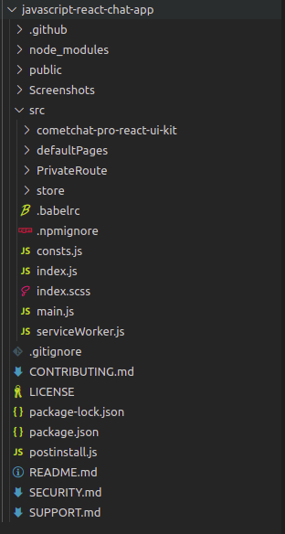
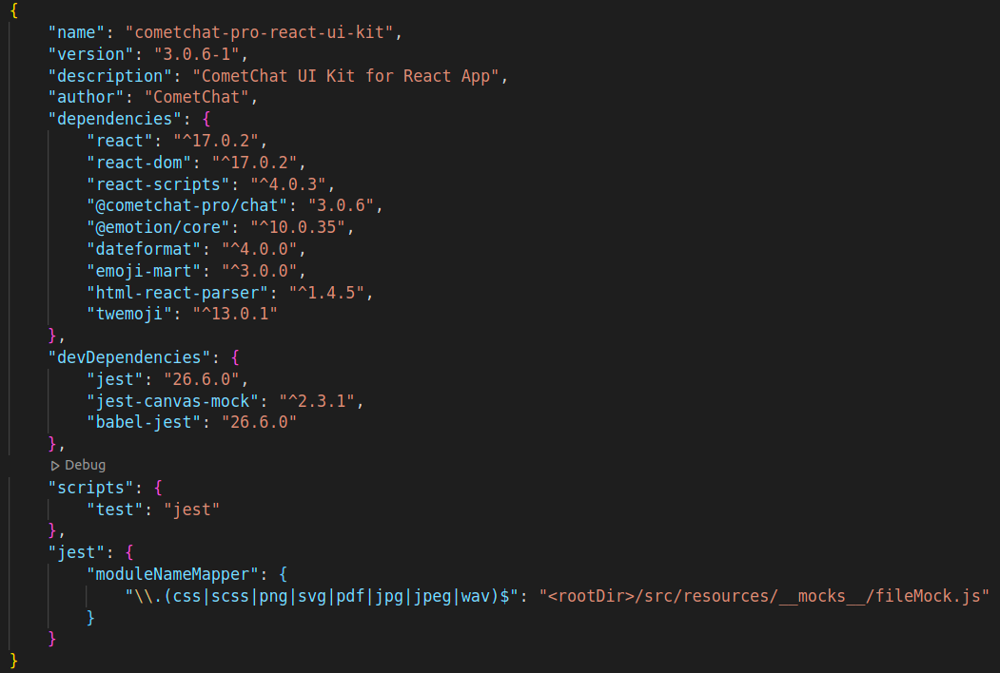

<div style="width:100%">
    <div style="width:50%;">
        <div align="center">
            
        </div>    
    </div>    
</div>

<br/><br/>

# CometChat React UI Kit

<p align="left">
  <a href="https://github.com/cometchat-pro/cometchat-pro-react-ui-kit/releases/" alt="Releases">
    
  </a>
  <a href="https://img.shields.io/github/languages/top/cometchat-pro/cometchat-pro-react-ui-kit">
    
  </a>
  <a href="https://github.com/cometchat-pro/cometchat-pro-react-ui-kit/stargazers">
    
  </a>
  <a href="https://twitter.com/CometChat">
    
  </a>
</p>

</br></br>

<div style="width:100%">
    <div style="width:50%; display:inline-block">
        <div align="center">
              
        </div>    
    </div>    
</div>

</br></br>

CometChat React UI Kit is a collection of custom UI Components designed to build text chat and voice/video calling features in your application.

The UI Kit is developed to keep developers in mind and aims to reduce development efforts significantly.

---

## Features

- Private(1-1) & Group Conversations
- Voice & video calling & conferencing
- Rich Media Attachments
- Typing Indicators
- Text, Media and Custom messages
- Read receipts
- Online Presence Indicators
- Message History
- Users & Friends List
- Search by users and groups
- Groups List
- Conversations List
- Threaded Conversations

## Extensions

[Thumbnail Generation](https://prodocs.cometchat.com/docs/extensions-thumbnail-generation) | [Link Preview](https://prodocs.cometchat.com/docs/extensions-link-preview) | [Rich Media Preview](https://prodocs.cometchat.com/docs/extensions-rich-media-preview) | [Smart Reply](https://prodocs.cometchat.com/docs/extensions-smart-reply)| [Emojis](https://prodocs.cometchat.com/docs/extensions-emojis) | [Polls](https://prodocs.cometchat.com/docs/extensions-polls) | [Reactions](https://prodocs.cometchat.com/docs/extensions-reactions) | [Stickers](https://prodocs.cometchat.com/docs/extensions-stickers)

---

## Prerequisites

Before you begin, ensure you have met the following requirements:

- A text editor, to write code in. This could be a text editor (e.g. [Visual Studio Code](https://code.visualstudio.com/), [Notepad++](https://notepad-plus-plus.org/), [Sublime Text](https://www.sublimetext.com/), [Atom](https://atom.io/), or [VIM](https://www.vim.org/))

- [Node](https://nodejs.org/)

- [npm](https://www.npmjs.com/get-npm)

- React `npm install react@17.0.2`

- React DOM `npm install react-dom@17.0.2`

- React scripts `npm install react-scripts@4.0.3`

---

## Installing React UI Kit

## 1. Setup :wrench:

### i. Register on CometChat 🔧

To install React UI Kit, you need to first register on CometChat Dashboard. <a href="https://app.cometchat.com/signup" target="_blank">Click here to sign up</a>

### ii. Get your Application Keys :key:

- Create a new app. Please follow the steps provided in the <a href="https://www.cometchat.com/docs/react-chat-ui-kit/key-concepts" target="_blank">Key concepts guide</a> to create V3 apps before you proceed.
- Head over to the Quick Start or API & Auth Keys section and note the `App ID`, `Auth Key`, and `Region`.

### iii. Add the CometChat Dependency

```javascript
  npm install @cometchat-pro/chat@3.0.11 --save
```

<br/>

## 2. Configure CometChat inside your app

### i. Import CometChat SDK

```javascript
import { CometChat } from "@cometchat-pro/chat";
```

### ii. Initialize CometChat 🌟

The `init()` method initializes the settings required for CometChat.
We suggest calling the `init()` method on app startup, preferably in the `index.js` file.

```javascript
const appID = "APP_ID";
const region = "REGION";
const appSetting = new CometChat.AppSettingsBuilder()
	.subscribePresenceForAllUsers()
	.setRegion(region)
	.build();
CometChat.init(appID, appSetting).then(
	() => {
		console.log("Initialization completed successfully");
		// You can now call login function.
	},
	(error) => {
		console.log("Initialization failed with error:", error);
		// Check the reason for error and take appropriate action.
	}
);
```

**Note:**</br>

- Replace APP_ID and REGION with your CometChat `App ID` and `Region` in the above code.

### iii. Login your user 👤

This method takes `UID` and `Auth Key` as input parameters and returns the User object containing all the information of the logged-in user..

```javascript
const authKey = "AUTH_KEY";
const uid = "SUPERHERO1";

CometChat.login(uid, authKey).then(
	(user) => {
		console.log("Login Successful:", { user });
	},
	(error) => {
		console.log("Login failed with exception:", { error });
	}
);
```

**Note:** </br>

- Replace `AUTH_KEY` with your CometChat `Auth Key` in the above code.

- We have setup 5 users for testing having UIDs: `SUPERHERO1`, `SUPERHERO2`, `SUPERHERO3`,`SUPERHERO4` and `SUPERHERO5`.

<br/>

## 3. Add UI Kit to your project

- Clone this repository `git clone https://github.com/cometchat-pro/cometchat-pro-react-ui-kit.git`
- Copy the cloned repository to your source folder



- Copy all the dependencies from package.json into your project's package.js and install them



<br/>

## 4. Launch CometChat

Using the **CometChatUI** component, you can launch a fully functional chat application. In this component all the UI Screens and UI Components are interlinked and work together to launch a fully functional chat on your website/application.

### Usage

- Import CometChatUI component
- Embed CometChatUI component in container and provide an appropriate width and height to the container

```javascript
import { CometChatUI } from "./CometChatWorkspace/src";

class App extends React.Component {
	render() {
		return (
			<div style={{ width: "800px", height: "800px" }}>
				<CometChatUI />
			</div>
		);
	}
}
```

# Checkout our sample app

Visit our [React sample app](https://github.com/cometchat-pro/javascript-react-chat-app) repo to run the React sample app.

---

# Troubleshooting

- To read the full documentation on UI Kit integration visit our [Documentation](https://www.cometchat.com/docs/react-chat-ui-kit/overview).

- Facing any issues while integrating or installing the UI Kit please connect with us via real time support present in <a href="https://app.cometchat.com/" target="_blank">CometChat Dashboard.</a>

---

# Contributors

Thanks to the following people who have contributed to this project:

[👨‍💻 @priyadarshininadar](https://github.com/priyadarshininadar) <br>
[👨‍💻 @ajaygajra](https://github.com/ajaygajra) <br>
[👨‍💻 @prathamesh-majgaonkar](https://github.com/prathamesh-majgaonkar) <br>
[👨‍💻 @mayur-bhandari](https://github.com/mayur-bhandari)

---

# Contact :mailbox:

Contact us via real time support present in [CometChat Dashboard](https://app.cometchat.com/).

---

# License

---

This project uses the following [license](https://github.com/cometchat-pro/cometchat-pro-react-ui-kit/blob/master/LICENSE).
